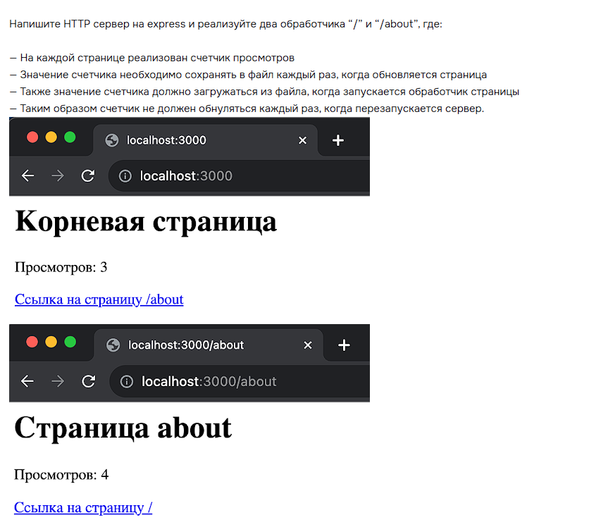

# express #

## Урок 3. Модули и фреймворк Express (WIP) ##

1. Установил express:

<code> npm install express  
const express = require('express');
</code>

2. Подключил fs:

<code>const fs = require('fs'); </code>

Результат - в файле [index.js](index.js)